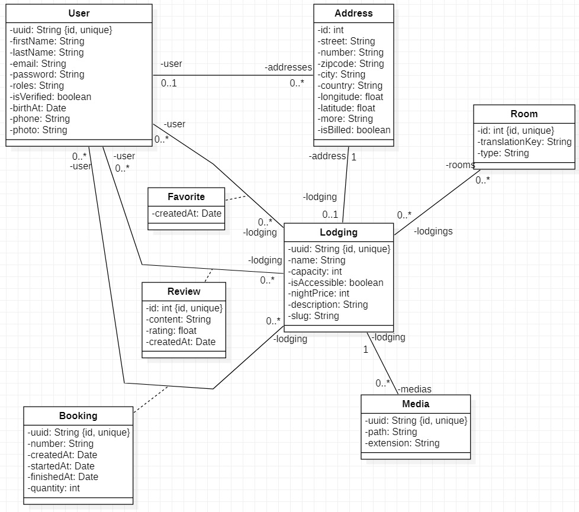
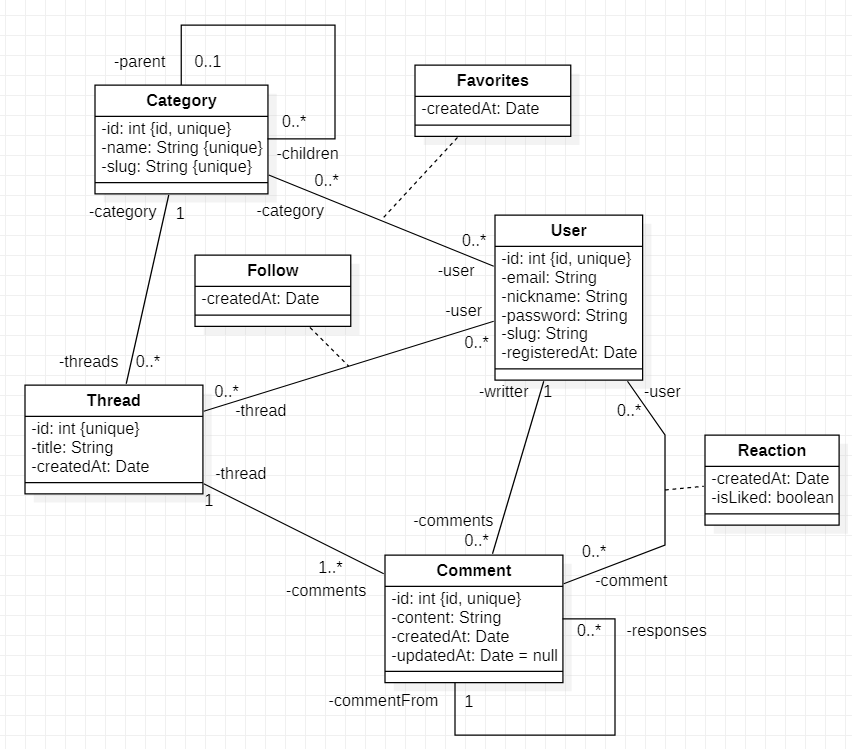

### 18/09/2024 - Exo Spring Data

## 1. Création des entités

À partir de l'UML donné, faire le mapping relationnel (complet) des entités de l'application "lodging"

Définition des "nullables" (les attributs non précisé ici ne le sont pas) :
- Entity User
  - phone
  - photo
- Entity lodging
  - description
- Entity Address
  - more

(Libre à vous de limiter la taille des colonnes de type String)

## 1. Création des entités

À partir de l'UML donné, faire le mapping relationnel (complet) des entités de l'application "redditish"

**Aucun attribut n'est nullable !**

(Libre à vous de limiter la taille des colonnes de type String)

